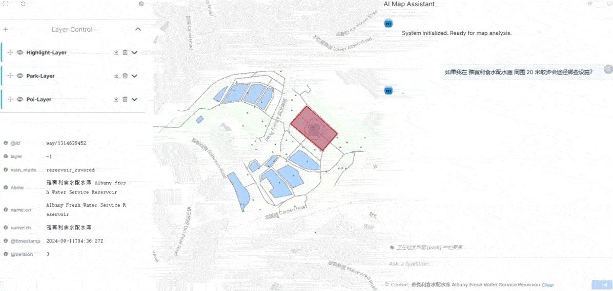

# GeoAI Professional Service

基于 AI 的地理空间分析工具，利用 GIS 数据与智能代理提供地块分析、空间计算和可视化服务。



## 功能特性

- AI 驱动的 GIS 分析（基于 DeepSeek 模型）
- 空间数据加载与处理（GeoJSON 格式）
- 实时可视化输出（地图与图表）
- 流式响应与状态推送（SSE）
- 前后端分离架构

## 技术栈

### 后端
- Python 3.12
- FastAPI（Web 框架）
- Pydantic AI（AI Agent 框架）

### 前端
- Vue 3 + Vite
- Element Plus（UI 组件）
- Deck.gl + MapLibre GL（地图可视化）
- Pinia（状态管理）

## 环境要求

- **Python**: 3.12
- **Node.js**: 18+ （前端开发）
- **包管理工具**: uv（Python）、pnpm/npm（前端）
- **API 密钥**: DeepSeek API

## 快速启动

### 1. 安装 uv（如未安装）

```bash
# macOS / Linux
curl -LsSf https://astral.sh/uv/install.sh | sh

# Windows (PowerShell)
powershell -c "irm https://astral.sh/uv/install.ps1 | iex"
```

### 2. 克隆项目并安装后端依赖

```bash
git clone <your-repo-url>
cd <project-folder>

# 创建虚拟环境并安装依赖
uv venv --python 3.12
source .venv/bin/activate  # Windows: .venv\Scripts\activate
uv pip install -r requirements.txt
```

### 3. 配置环境变量

```bash
cp .env.example .env
```

编辑 `.env` 文件：

```env
DEEPSEEK_API_KEY=your-api-key-here
```

### 4. 启动后端服务

```bash
uv run python -m src.main
# 或
python main.py
```

后端服务将在 `http://localhost:8000` 运行。

### 5. 启动前端

```bash
# 安装前端依赖
npm install

# 启动开发服务器
npm run docs:dev
```

## API 接口

### 聊天分析接口

`POST /api/chat`

**请求体**：

```json
{
  "query": "分析这个区域的绿地分布",
  "history": []
}
```

**响应**：Server-Sent Events（SSE）流式响应

- `status`: 处理状态更新
- `final_result`: 最终分析结果（包含报告和 GeoJSON 数据）
- `error`: 错误信息

## 项目结构

```
├── src/
│   ├── main.py           # FastAPI 应用入口
│   ├── agent.py          # AI Agent 定义
│   ├── schema.py         # 数据模型与依赖注入
│   └── ...
├── data/                 # GeoJSON 数据文件
├── docs/                 # 前端文档/源码
├── .env.example          # 环境变量示例
├── requirements.txt      # Python 依赖
└── README.md
```

## 核心功能说明

### 1. 智能分析流程
- 用户输入查询 → AI Agent 解析意图
- 自动调用 GIS 工具（空间查询、缓冲区分析等）
- 实时推送处理状态
- 返回分析报告 + GeoJSON 可视化数据

### 2. 可视化输出
后端返回的 `geojson` 字段为标准 FeatureCollection 格式，可直接被前端 Deck.gl 渲染：

```json
{
  "type": "FeatureCollection",
  "features": [...]
}
```